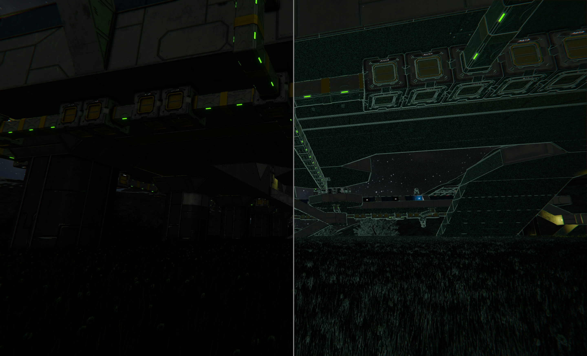
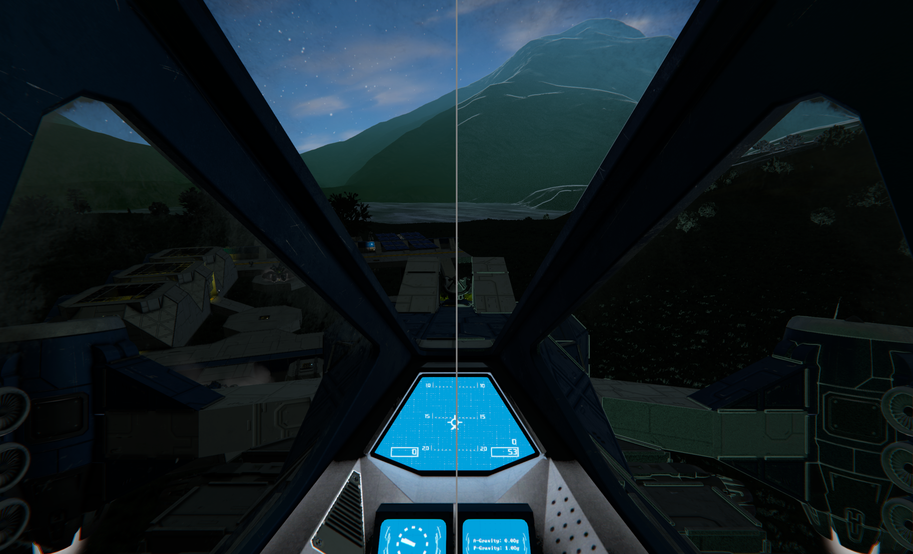

# Night Vision
Night Vision is a client plugin for Space Engineers, inspired by Elite Dangerous.
It brightens dark scenes, outlines nearby geometry, and adds a short-range infrared fallback when there is no visible light.
The effect is local and does not change gameplay.

Install Night Vision through [Pulsar](https://github.com/SpaceGT/Pulsar) by selecting it in the Plugins tab.

## Examples

&emsp;

## Using it
Hold the light key (`L` by default) to toggle night vision.
A short press still toggles your light, and rebinding the light control also changes the night vision key.

With the default settings, a closed helmet uses active night vision on foot and passive night vision in vehicles.
An open helmet only shows the effect through one-way glass.
Ship cameras use active mode, while third person and spectator views use passive mode.

You can change these modes and adjust the image in the plugin settings.

## Building
Use a Pulsar DevFolder with `NightVision.xml`, or build `NightVision.sln` to deploy the plugin to Pulsar's local plugin folder.

## Support
Report bugs on the [Pulsar Discord](https://discord.gg/z8ZczP2YZY).
